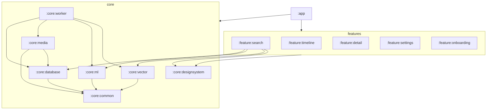

# Recall

Offline semantic search for your photo and video gallery, powered by on-device machine learning.

## What is Recall?

Recall is an Android app that lets you find photos and videos by describing what you remember — not by filenames, folders, or exact dates. Type a natural-language query like "sunset at the beach" or "birthday cake with candles," and Recall ranks your library by visual meaning using embedding vectors computed entirely on your device.

Your media never leaves your phone. Recall does not request network access: there is no cloud upload, no analytics endpoint, and no account system. Indexing runs in the background via WorkManager after you grant photo/video read permissions. Embeddings are generated locally (currently via a deterministic mock model for development; a real TFLite model is planned), stored in an in-memory vector index for search, and metadata is kept in a local Room database.

The app is built as a multi-module Kotlin project with Jetpack Compose, Hilt dependency injection, and a clean separation between core infrastructure (database, media scanning, ML, vector search, background workers) and feature screens (search, timeline, detail, settings, onboarding).

## Architecture

Recall follows a **layered, multi-module** structure:

- **`:app`** — Application entry, navigation shell, app-level Hilt bindings (`VectorModule`).
- **`:core:*`** — Reusable libraries with no UI: common dispatchers, Room database, MediaStore integration, ML embedding, vector index, WorkManager pipeline, design system.
- **`:feature:*`** — Compose screens and ViewModels; depend only on the core modules they need.
- **`:build-logic`** — Gradle convention plugins shared across modules.



See [docs/ARCHITECTURE.md](docs/ARCHITECTURE.md) for data-flow diagrams, interface contracts, and recovery design.

## Tech Stack

| Technology | Version |
|------------|---------|
| Android Gradle Plugin | 9.2.1 |
| Kotlin | 2.2.10 |
| KSP | 2.3.7 |
| Jetpack Compose BOM | 2026.02.01 |
| Hilt | 2.59.2 |
| Room | 2.8.4 |
| Navigation Compose | 2.9.8 |
| WorkManager | 2.11.2 |
| Coil | 3.4.0 |
| Kotlin Coroutines | 1.10.2 |
| TensorFlow Lite | 2.17.0 |
| compileSdk / targetSdk | 36 |
| minSdk | 28 |

## Building

**Requirements:** Android Studio Ladybug or newer, JDK 11+, Android SDK 36.

```bash
# Clone and open in Android Studio, or from the project root:
./gradlew assembleDebug

# Install on a connected device or emulator (API 28+)
./gradlew installDebug
```

On first launch, complete onboarding to grant media permissions. The app enqueues a background scan and embedding pipeline automatically. Open **Search** once indexing progress appears (indexed count in the empty state).

## Project Structure

| Module | Description |
|--------|-------------|
| `:app` | `RecallApplication`, `MainActivity`, `RecallNavHost`, `VectorModule`, startup initializer |
| `:core:common` | `RecallDispatchers`, shared coroutine dispatchers |
| `:core:database` | Room DB, entities, DAOs, schema export |
| `:core:designsystem` | `RecallTheme`, shared Compose components |
| `:core:media` | MediaStore scanner, thumbnails, keyframes, content observer |
| `:core:ml` | `EmbeddingModel`, mock implementation, device profiling |
| `:core:vector` | `VectorIndex`, `LinearScanIndex`, distance utilities |
| `:core:worker` | Background scan/embed workers, pipeline manager, integrity recovery |
| `:feature:search` | Semantic search UI and ViewModel |
| `:feature:timeline` | Chronological media grid (integration in progress) |
| `:feature:detail` | Full-screen media view (integration in progress) |
| `:feature:settings` | Model profile, storage, reindex controls (integration in progress) |
| `:feature:onboarding` | Permission gate |
| `:build-logic` | Convention plugins (`recall.android.*`, `recall.hilt`) |

Documentation: [docs/PROJECT_STATE.md](docs/PROJECT_STATE.md) · [docs/ARCHITECTURE.md](docs/ARCHITECTURE.md) · [docs/WORK_LOG.md](docs/WORK_LOG.md)

## Development Phases

| Phase | Status | Focus |
|-------|--------|-------|
| 0 | Done | Multi-module Gradle, convention plugins |
| 1 | Done | Compose UI shell, navigation, theme |
| 2 | Done | Room schema v1 |
| 3 | Done | MediaStore scanner and thumbnails |
| 4 | Done | ML interfaces + mock embeddings |
| 5 | Done | Vector index + search screen |
| 6 | Planned | HNSW approximate search |
| 7 | Planned | Segmented on-disk vector storage |
| 8 | Done | WorkManager indexing pipeline |
| 9 | Done | Startup integrity and failed-job recovery |
| 10 | Done | Unit tests (68 JVM tests) |
| 11a | In progress | Timeline, detail, settings data binding |

## Testing

```bash
# All JVM unit tests
./gradlew testDebugUnitTest

# Per module
./gradlew :core:database:testDebugUnitTest
./gradlew :core:vector:testDebugUnitTest
./gradlew :core:ml:testDebugUnitTest
```

**Coverage (68 tests):** Room type converters and DAO CRUD/observables (Robolectric + in-memory DB), `MockEmbeddingModel` / `ModelProfileSelector`, `LinearScanIndex` and concurrency, `VectorDistance` edge cases, `DeletionBitmap`, `RecallDispatchers`.

Android instrumented tests exist under `:core:ml` (`ImagePreprocessor`, mock embed on device); run with `./gradlew connectedDebugAndroidTest` when a device is attached.

## Privacy

- **No internet permission** — the app cannot open network sockets for Recall functionality.
- **On-device indexing** — MediaStore metadata and embeddings stay in app-private storage and memory.
- **User-controlled access** — Android 13+ granular media permissions; legacy storage permission capped at API 32.
- **No third-party SDKs** for search or analytics in the MVP stack.

## License

TBD — placeholder: [Apache License 2.0](https://www.apache.org/licenses/LICENSE-2.0) unless otherwise specified by the project owners.
