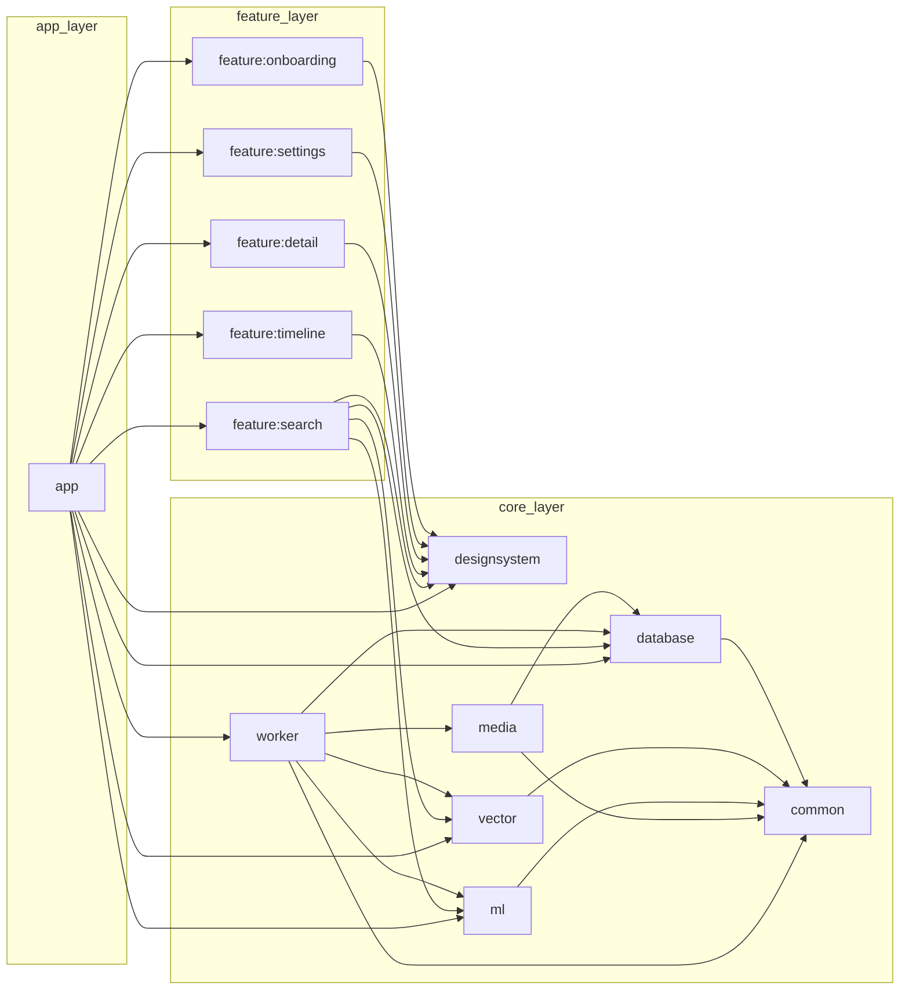
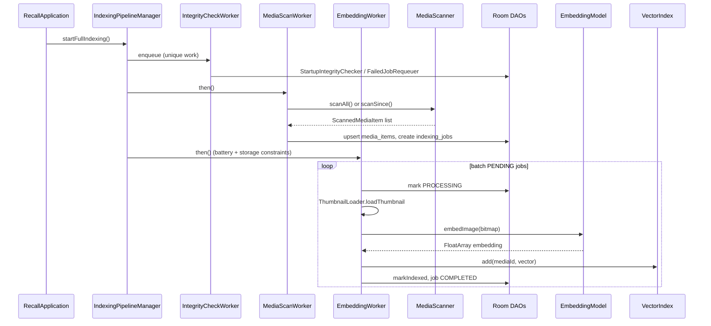
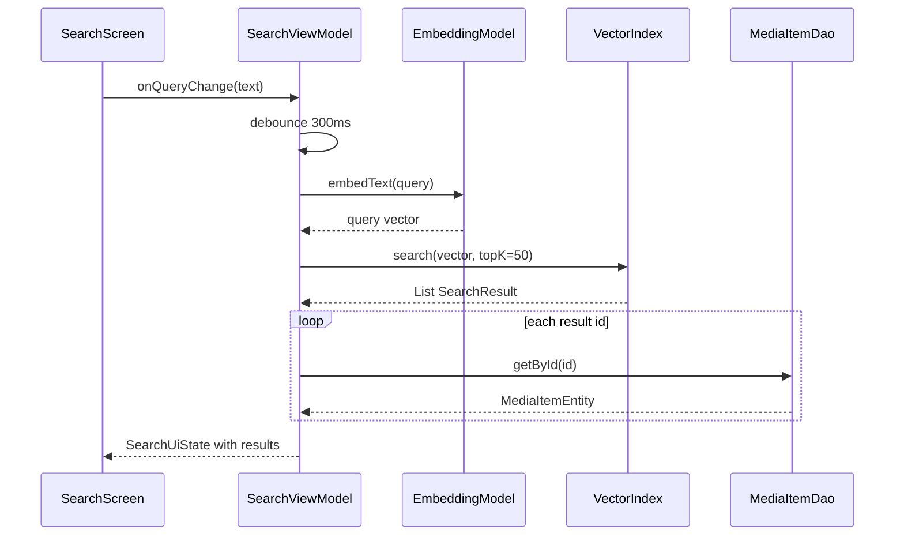
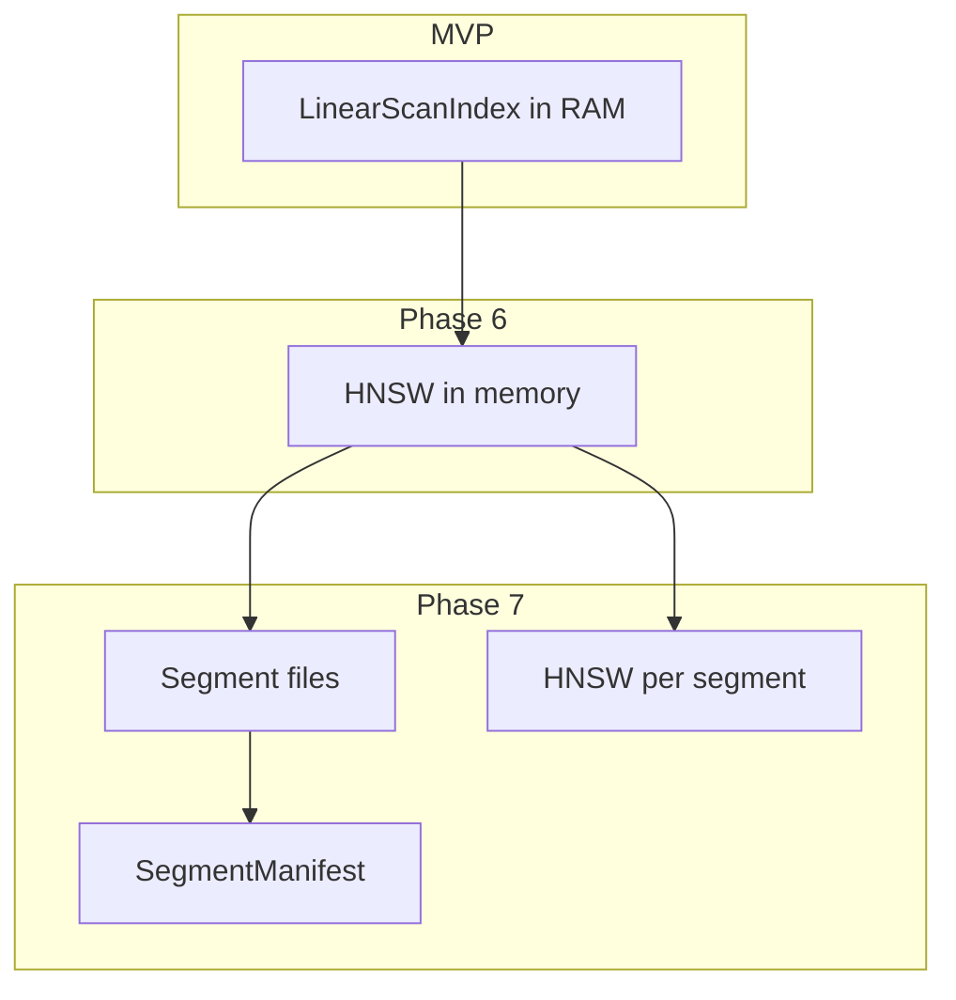

# Recall — Architecture

This document describes the technical architecture of the Recall Android app as implemented in the MVP (commit `424482c` on `main`). For a concise status snapshot, see [PROJECT_STATE.md](PROJECT_STATE.md).

## Design Goals

1. **Offline-first** — No network; all ML and search on-device.
2. **Modular boundaries** — Core libraries are UI-free; features depend downward only.
3. **Testable contracts** — `EmbeddingModel`, `VectorIndex`, and Room DAOs are interface-driven.
4. **Evolvable index** — MVP uses `LinearScanIndex`; schema and segment types anticipate HNSW and on-disk segments.

## Module Dependency Graph



**Rules:**

- `:core:*` modules must not depend on `:feature:*` or `:app`.
- `:feature:*` modules use the `recall.android.feature` plugin (Compose + Hilt + designsystem).
- App-level bindings that need multiple cores (e.g. `VectorIndex` implementation choice) live in `:app` (`VectorModule`).

## Layer Responsibilities

| Layer | Responsibility |
|-------|----------------|
| **Presentation** (`:feature:*`, `:app` navigation) | Compose UI, ViewModels, navigation extensions |
| **Domain / use cases** | Currently embedded in ViewModels and Workers (no separate domain module yet) |
| **Data** (`:core:database`, `:core:media`) | Room persistence, MediaStore I/O |
| **ML** (`:core:ml`) | Embedding generation, preprocessing, device capability profiles |
| **Search** (`:core:vector`) | Vector storage, similarity search, future segment/HNSW |
| **Infrastructure** (`:core:worker`, `:core:common`) | Background work, dispatchers, recovery |

## Data Flow: Indexing Pipeline

Triggered on app start by `AppStartupInitializer.initialize()` → `IndexingPipelineManager.startFullIndexing()`.



**Key classes:**

- `MediaScanWorker` — Reads `AppSettingsKeys.LAST_MEDIA_SCAN_TIMESTAMP`, full or incremental scan, upserts `MediaItemEntity`, enqueues `IndexingJobEntity` with `PENDING`.
- `EmbeddingWorker` — Processes up to `BATCH_SIZE` pending jobs; uses thumbnail (not full-resolution) for images/videos.
- `IntegrityCheckWorker` — Runs before scan in the unique chain; invokes recovery helpers.

**Periodic work:** `startPeriodicScan()` registers a 6-hour `MediaScanWorker` with battery-not-low constraint.

## Data Flow: Search

User query path in `SearchViewModel` (feature module):



Cosine similarity is computed in `LinearScanIndex` via `VectorDistance.cosineSimilarity`. Results are sorted by descending score.

## Key Interfaces and Contracts

### `EmbeddingModel` (`:core:ml`)

```kotlin
interface EmbeddingModel {
    suspend fun embedImage(bitmap: Bitmap): FloatArray
    suspend fun embedText(text: String): FloatArray
    val dimensions: Int
    val profileName: String
    fun close()
}
```

MVP binding: `MlModule` provides `MockEmbeddingModel` (deterministic, L2-normalized). `ModelProfileSelector` chooses Lite/Standard/Pro dimensions based on `DeviceProfiler`.

### `VectorIndex` (`:core:vector`)

```kotlin
interface VectorIndex {
    suspend fun add(id: Long, vector: FloatArray)
    suspend fun addBatch(entries: List<Pair<Long, FloatArray>>)
    suspend fun search(query: FloatArray, topK: Int): List<SearchResult>
    suspend fun remove(id: Long)
    suspend fun contains(id: Long): Boolean
    fun size(): Int
    fun dimensions(): Int
    fun clear()
}
```

MVP implementation: `LinearScanIndex` — `Mutex`-guarded `MutableMap<Long, FloatArray>`. App binding in `VectorModule`:

```kotlin
fun provideVectorIndex(embeddingModel: EmbeddingModel): VectorIndex =
    LinearScanIndex(embeddingModel.dimensions)
```

Future: `VectorIndexFactory` and HNSW/segment-backed implementations without changing feature call sites.

### `SegmentManifest` (placeholder)

Interfaces under `core/vector/segment/` define future Phase 7 APIs for listing and updating on-disk segments. Room already has `VectorSegmentEntity` and `VectorPostingEntity` for persistence mapping.

## Dependency Injection (Hilt)

| Module | Location | Provides |
|--------|----------|----------|
| `CommonModule` | `:core:common` | `RecallDispatchers` |
| `DatabaseModule` | `:core:database` | `RecallDatabase`, all DAOs |
| `MediaModule` | `:core:media` | `MediaScanner`, `ThumbnailLoader`, `MediaSyncManager`, … |
| `MlModule` | `:core:ml` | `EmbeddingModel`, `DeviceProfiler`, `ModelProfileSelector` |
| `WorkerModule` | `:core:worker` | Worker-related bindings |
| `VectorModule` | `:app` | `VectorIndex` → `LinearScanIndex` |

Workers use `@HiltWorker` + `@AssistedInject`. `RecallApplication` implements `Configuration.Provider` and supplies `HiltWorkerFactory`.

**Scopes:** Database and index singletons are `@Singleton` for the process lifetime.

## Room Schema

Version **1**, exported JSON at `core/database/schemas/com.recall.app.core.database.RecallDatabase/1.json`.

### `media_items`

Primary key: MediaStore `id`. Tracks URI, display name, dates, dimensions, MIME type, optional video `duration`, `is_indexed`, `embedding_version`, and future `segment_id` / `local_vector_index` / `is_deleted`.

### `indexing_jobs`

Queue for embedding work. FK to `media_items.id` with `ON DELETE CASCADE`. Status via `IndexingStatus` converter.

### `vector_segments` / `vector_postings`

Reserved for Phase 7 segmented index. Postings map global media IDs to segment-local indices.

### `app_settings`

Key-value store (e.g. `last_media_scan_timestamp` via `AppSettingsKeys`).

### `model_profiles`

Stores active model profile metadata for settings (future UI).

## Vector Search Design

### Current: Linear Scan

- **Storage:** In-memory only, keyed by `mediaItemId`.
- **Query:** Full scan over all vectors, cosine similarity, top-K heap via sort + take.
- **Concurrency:** `Mutex` on mutations; search copies map snapshot under lock.
- **Deletion:** `remove(id)`; `DeletionBitmap` tested for future soft-delete in segmented stores.

**Limitations:** O(n) latency; vectors not restored after process death until `EmbeddingWorker` re-runs.

### Planned: Phase 6 — HNSW

Approximate nearest neighbor graph in memory or mmap'd file. Target: sub-linear query time for large libraries. `VectorIndex` interface remains stable.

### Planned: Phase 7 — Segmented HNSW

- Vectors sharded into segment files under `context.filesDir/segments/`.
- `SegmentManifest` tracks active segments, deleted counts, and compaction.
- `VectorPostingEntity` resolves global ID → (segmentId, localIndex).
- `StartupIntegrityChecker` already creates/verifies segments directory and cleans `*.tmp` orphans.



## WorkManager Pipeline

| Unique work name | Policy | Workers |
|------------------|--------|---------|
| `recall-index-pipeline` | `KEEP` chain | Integrity → Scan → Embed |
| `recall-periodic-scan` | Periodic 6h | MediaScanWorker |
| `recall-integrity-check` | One-time | IntegrityCheckWorker |

`IndexingPipelineManager.observePipelineStatus()` exposes `Flow<List<WorkInfo>>` for UI progress (not yet wired in Settings at MVP commit).

## Consistency and Recovery

### On integrity check / worker start

1. **`StartupIntegrityChecker.requeueStuckJobs()`** — Any `PROCESSING` jobs reset to `PENDING` (crash mid-embed).
2. **`cleanOrphanedTempFiles()`** — Deletes `*.tmp` under `filesDir/segments`.
3. **`purgeOldCompletedJobs()`** — Housekeeping hook (DAO `deleteCompleted`).
4. **`FailedJobRequeuer`** — `FAILED` with `retry_count < 3` → `PENDING`.

### Embedding worker defensive checks

- Requeues `PROCESSING` at batch start (same as integrity).
- Skips deleted or missing media rows.
- Records `error_message` and `FAILED` status on thumbnail/embedding failures.

### Media sync (optional path)

`MediaContentObserver` + `MediaSyncManager` support reacting to gallery changes outside the periodic scan (wired for future real-time incremental updates).

## Media Layer

| Component | Role |
|-----------|------|
| `MediaScanner` | Queries `MediaStore` images + videos (full or `DATE_ADDED` incremental) |
| `ThumbnailLoader` | API 28–36 thumbnail sizing via `ContentResolver` |
| `KeyframeExtractor` | Video frame extraction for future multi-vector indexing |
| `MediaPermissionHelper` | Permission state helpers for onboarding |
| `MediaContentObserver` | Registers for gallery URI changes |

## UI and Navigation

- **Single-activity** `MainActivity` with `RecallApp` scaffold and bottom navigation (Search, Timeline, Settings).
- **Routes:** `search`, `timeline`, `settings`, `detail/{mediaId}`, `onboarding` (string constants in `RecallRoute`).
- **Onboarding gate:** Shown when media permissions are missing; otherwise start at Search.
- **Design system:** Dark-first `RecallTheme`; shared `RecallSearchBar`, `MediaGridItem`, `RecallTopBar`, loading/empty/error states.

## Testing Architecture

- **JVM unit tests** with JUnit 4; Room DAO tests use Robolectric + `Room.inMemoryDatabaseBuilder` + `InstantTaskExecutorRule`.
- **Vector/ML tests** pure JVM (no Robolectric required).
- **androidTest** in `:core:ml` for `Bitmap` preprocessing and device embed smoke tests.
- Convention plugin sets `isIncludeAndroidResources = true` for library unit tests and `failOnNoDiscoveredTests = false` for Hilt-only modules.

## Security and Privacy Model

- Manifest permissions: `READ_MEDIA_IMAGES`, `READ_MEDIA_VIDEO`, `READ_EXTERNAL_STORAGE` (maxSdk 32 only).
- No `INTERNET`, `ACCESS_NETWORK_STATE`, or backup of embeddings to cloud by app design.
- Vectors in MVP RAM are cleared on process death; no cross-app exposure.

## Related Documents

- [PROJECT_STATE.md](PROJECT_STATE.md) — Phase status, limitations, next steps
- [WORK_LOG.md](WORK_LOG.md) — Per-phase agent log with commits
