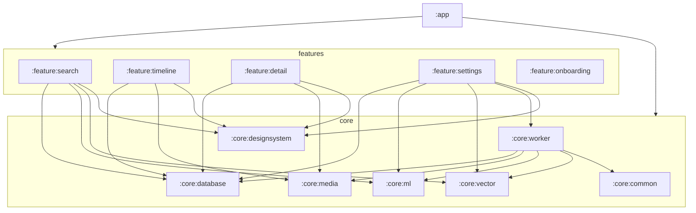

# Recall — Project State

**Last updated:** 2026-05-21, after Phase 7 (segmented HNSW + mmap on `post-mvp`)  
**HEAD (main):** `6e7136a` — 12 commits (pre-merge)  
**HEAD (post-mvp):** `53fe180` — Phase 7 segmented vector engine  
**Status:** Post-MVP feature set complete: HNSW + persistence + benchmarks + TFLite embedding + segmented mmap index. App still binds `PersistentVectorIndex`; wire `SegmentedVectorIndex` when ready. Next: bundle MobileCLIP `.tflite` assets + golden tests.

## Current Phase

**Post-MVP complete** — on branch `post-mvp`. All planned post-MVP phases are done: UX polish (11b), HNSW (6/6.1), benchmarks (10b), TFLite embedding (4b), segmented on-disk index (7). Ready to merge into `main`. Remaining follow-up: wire `SegmentedVectorIndex` in `VectorModule`, bundle `.tflite` assets.

## Completed Work (12 commits on `main`)

| Phase | Commit (short) | Summary |
|-------|------------------|---------|
| 0 | `c764b3e` | Multi-module Gradle, convention plugins, version catalog |
| 1 | `900248f` | RecallTheme, NavHost, bottom nav, stub feature screens, onboarding permissions |
| 2 | `b0ebfa3` | Room v1: 6 entities, 6 DAOs, Hilt `DatabaseModule`, exported schema |
| 3 | `2abc4a2` | MediaStore: `MediaScanner`, `ThumbnailLoader`, `KeyframeExtractor`, `MediaContentObserver`, `MediaSyncManager` |
| 4 | `982944a` | `EmbeddingModel`, `MockEmbeddingModel`, `DeviceProfiler`, `ModelProfileSelector`, `ImagePreprocessor` |
| 5 (vector) | `b762a43` | `VectorIndex`, `LinearScanIndex`, `VectorDistance`, `DeletionBitmap`, segment placeholders |
| 5 (search) | `e275cf2` | `SearchViewModel` + `SearchScreen` wired to embed → search → Room lookup |
| 8 | `8d2375e` | WorkManager: `MediaScanWorker`, `EmbeddingWorker`, `IndexingPipelineManager` |
| 9 | `197c4fa` | `IntegrityCheckWorker`, `StartupIntegrityChecker`, `FailedJobRequeuer` |
| 0.1 | `ee39cf1` | `RecallDispatchersTest`, Hilt test discovery fix |
| 10 | `424482c` | 68 JVM unit tests (common, database, ml, vector) |
| 11a | `6e7136a` | Timeline, Detail, Settings wired to Room + pipeline + `VectorIndex` |

## Architecture (module graph)

```
:build-logic          convention plugins (library, feature, application, compose, hilt)
:app                  Hilt Application, MainActivity, NavHost, VectorModule, AppStartupInitializer
├── :core:common           RecallDispatchers, CommonModule
├── :core:database         RecallDatabase (Room v1), 6 entities, 6 DAOs, DatabaseModule
├── :core:designsystem     RecallTheme, SearchBar, MediaGridItem, TopBar, Loading/Empty/Error
├── :core:media            MediaScanner, ThumbnailLoader, KeyframeExtractor, MediaContentObserver, MediaSyncManager
├── :core:ml               EmbeddingModel, TFLiteEmbeddingModel, MockEmbeddingModel (fallback), DeviceProfiler, ModelProfileSelector, MlModule
├── :core:vector           VectorIndex, HNSW, PersistentVectorIndex, SegmentedVectorIndex, segment format (mmap), benchmarks
├── :core:worker           MediaScanWorker, EmbeddingWorker, IntegrityCheckWorker, IndexingPipelineManager, recovery
├── :feature:search        SearchScreen + SearchViewModel (vector search)
├── :feature:timeline      TimelineScreen + TimelineViewModel (Room Flow grid, date headers)
├── :feature:detail        MediaDetailScreen + MediaDetailViewModel (metadata + preview)
├── :feature:settings      SettingsScreen + SettingsViewModel (indexing status, reindex, clear index)
└── :feature:onboarding    OnboardingScreen (READ_MEDIA_* permission flow)
```

Dependency direction: **features → core** (never core → feature). `:app` aggregates features and binds app-level singletons (`VectorModule`).



## Build Configuration

| Setting | Value |
|---------|-------|
| Package / applicationId | `com.recall.app` |
| Version | `0.1.0` (versionCode 1) |
| compileSdk | 36 |
| minSdk | 28 |
| targetSdk | 36 |
| Java | 11 |
| AGP | 9.2.1 |
| Kotlin | 2.2.10 |
| KSP | 2.3.7 |
| Compose BOM | 2026.02.01 |
| Hilt | 2.59.2 |
| Room | 2.8.4 |
| Navigation Compose | 2.9.8 |
| WorkManager | 2.11.2 |
| Coil | 3.4.0 |
| Coroutines | 1.10.2 |
| Lifecycle | 2.10.0 |
| TFLite | 2.17.0 + GPU delegate; `TFLiteEmbeddingModel` loads from assets when present |

Convention plugins in `:build-logic`: `recall.android.library`, `recall.android.feature`, `recall.android.application`, `recall.android.compose`, `recall.hilt`.

## Room Schema (v1)

**Database:** `RecallDatabase`, version 1, schema exported to `core/database/schemas/`.

| Entity | Table | Role |
|--------|-------|------|
| `MediaItemEntity` | `media_items` | MediaStore metadata, indexing flags, future segment mapping |
| `IndexingJobEntity` | `indexing_jobs` | Per-item embed job queue (FK → media_items, CASCADE) |
| `VectorSegmentEntity` | `vector_segments` | Future on-disk segment metadata (Phase 7) |
| `VectorPostingEntity` | `vector_postings` | Future id → segment/local index map (Phase 7) |
| `AppSettingEntity` | `app_settings` | Key-value app state (e.g. last scan timestamp) |
| `ModelProfileEntity` | `model_profiles` | Persisted Lite/Standard/Pro profile selection |

**Type converters:** `IndexingStatus` enum (`PENDING`, `PROCESSING`, `COMPLETED`, `FAILED`).

**DAOs:** `MediaItemDao`, `IndexingJobDao`, `VectorSegmentDao`, `VectorPostingDao`, `AppSettingDao`, `ModelProfileDao` — Flow observables + suspend queries.

## ML Pipeline Status

| Component | Status |
|-----------|--------|
| `EmbeddingModel` interface | Done (`embedImage`, `embedText`, `dimensions`, `profileName`) |
| `MockEmbeddingModel` | Done — fallback when `.tflite` asset missing; deterministic hash-seeded vectors |
| `TFLiteEmbeddingModel` | Done — loads MobileCLIP from assets, CLIP ImageNet preprocess, NNAPI/GPU delegates, L2-normalized output |
| `DeviceProfiler` | Done — RAM, CPU, disk, NNAPI detection |
| `ModelProfileSelector` | Done — Lite (384d), Standard (512d), Pro (512d) |
| `ImagePreprocessor` | Done — resize, SIMPLE [0,1] RGB, CLIP ImageNet mean/std normalization |
| Hilt binding | `MlModule` probes assets → `TFLiteEmbeddingModel` or `MockEmbeddingModel` |
| Text embeddings | Visual fingerprint bitmap → image tower (no text tower; `tensorflow-lite-support` still deferred) |
| Bundled `.tflite` files | **Not in repo** — inference activates when assets are added |
| `tensorflow-lite-support` | Still deferred (LiteRT manifest conflict) |

## Vector Search Status

| Component | Status |
|-----------|--------|
| `VectorIndex` interface | Done |
| `LinearScanIndex` | Done — in-memory brute-force cosine similarity, mutex-protected |
| `HnswIndex` | **Done** — pure Kotlin HNSW, recall@10 >= 0.95, serialize/deserialize |
| `PersistentVectorIndex` | **Done** — wraps HnswIndex with atomic file-based persistence |
| `VectorDistance` | Done — cosine similarity / distance helpers |
| `DeletionBitmap` | Done — soft-delete bookkeeping (tests) |
| `SegmentManifest` / `VectorPostingStore` | **Done** — interfaces + Room impls (`RoomSegmentManifest`, `RoomVectorPostingStore`) |
| `SegmentFormat` / `SegmentWriter` / `SegmentReader` | **Done** — binary layout (header, vectors, HNSW graph, CRC32), atomic tmp→rename publish |
| `SegmentHnswSearch` | **Done** — HNSW greedy search on mmap'd segment files |
| `SegmentedVectorIndex` | **Done** — staging `HnswIndex` (flush at 1000 vectors), frozen mmap segments, merged top-K search |
| App binding | `VectorModule` → `PersistentVectorIndex` (segmented engine available, not yet wired) |
| Settings `clearIndex()` | Clears index + resets `is_indexed` flags in Room |
| Benchmark suite | **Done** — search latency, indexing throughput, recall, memory, serialization |

## WorkManager Pipeline Status

| Component | Status |
|-----------|--------|
| `RecallApplication` | `Configuration.Provider` + `HiltWorkerFactory` |
| `AppStartupInitializer` | Enqueues full pipeline on cold start |
| `IndexingPipelineManager` | Unique chain: Integrity → Scan → Embed; periodic 6h scan |
| `MediaScanWorker` | MediaStore scan → upsert `media_items` → enqueue indexing jobs |
| `EmbeddingWorker` | Thumbnail → `embedImage` → `vectorIndex.add` → mark indexed |
| `IntegrityCheckWorker` | Runs `StartupIntegrityChecker` + `FailedJobRequeuer` |
| Constraints | Battery-not-low + storage-not-low on embed work |
| Settings UI | `observePipelineStatus()` drives indexing-in-progress state; **Re-index All** triggers `startFullIndexing()` |

## Consistency / Recovery Status

| Component | Status |
|-----------|--------|
| `StartupIntegrityChecker` | Requeue stuck `PROCESSING` jobs, clean `.tmp` in `files/segments`, purge completed jobs |
| `FailedJobRequeuer` | Requeue `FAILED` jobs with `retry_count < 3` |
| `EmbeddingWorker` | Requeues `PROCESSING` at start of each run |

## Feature UI Status

| Screen | Status |
|--------|--------|
| Search | **Complete** — debounced query, vector search, Coil thumbnails, indexed/total counts |
| Onboarding | **Complete** — READ_MEDIA_IMAGES/VIDEO (+ legacy READ_EXTERNAL_STORAGE ≤ API 32) |
| Timeline | **Complete** — `MediaItemDao.observeAll()` grid, date headers, indexing badge, tap → detail |
| Detail | **Complete** — `detail/{mediaId}` route, preview, metadata panel, indexing badge |
| Settings | **Complete** — indexing progress, model profile + device info, re-index, clear index |

## Important Decisions Log

- **Privacy-first:** No `INTERNET` permission; all indexing and search on-device.
- **Dark-first UI** with warm amber (`#F5A623`) accent and violet secondary (`#7B61FF`).
- **AGP 9.x:** Kotlin Android plugin built into AGP; no separate `kotlin-android` apply.
- **KSP 2.3.7** for Room/Hilt compatibility with AGP 9.
- **String routes** for Navigation (not type-safe) for MVP simplicity.
- **In-memory `LinearScanIndex`** as singleton — acceptable for MVP; not persisted across process death (rebuilt by `EmbeddingWorker`).
- **Mock embeddings** until real CLIP-style model and golden vectors land.
- **`tensorflow-lite-support` omitted** — LiteRT namespace/manifest conflict; revisit with real model.
- **Room WAL** default; snake_case columns via `@ColumnInfo`.
- **CASCADE** FKs on `indexing_jobs` and `vector_postings`.
- **Startup indexing** runs automatically via `AppStartupInitializer` (may be heavy on first launch).
- **Phase 11a:** Feature modules depend on `core:database` (and settings also on `ml`, `vector`, `worker`) for direct DAO/pipeline access from ViewModels.

## Known Limitations

- **Mock ML only** — search quality is not semantically meaningful until a real embedding model ships.
- **Linear scan** — O(n) per query; suitable only for small libraries; no persistence of vectors to disk yet.
- **Vectors lost on process kill** — in-memory index; full re-embed required unless Phase 7 segment storage is added.
- **Video semantics** — keyframe extractor exists; embed path uses single thumbnail per item.
- **Model profile read-only in Settings** — displays `ModelProfileSelector` result; no in-app profile switching UI yet.
- **No ViewModel or WorkManager unit tests** — coverage is core-module JVM tests only.
- **No instrumented UI tests** beyond template `ExampleInstrumentedTest`.
- **`MediaContentObserver`** implemented but not wired to automatic incremental sync from UI.

## Next Steps

1. **Wire segmented index** — Switch `VectorModule` from `PersistentVectorIndex` to `SegmentedVectorIndex.open()` with Room manifest/posting store.
2. **Phase 4b (follow-up)** — Bundle MobileCLIP `.tflite` assets, golden-vector androidTests, resolve `tensorflow-lite-support` for text tower.
3. **Performance** — Batch embed, incremental index updates.
4. **Polish** — Model profile picker, observer-driven incremental sync, search → detail from results.

## Build / Test Status

| Check | Result (verified on `post-mvp` `53fe180`, 2026-05-21) |
|-------|--------------------------------------------------------|
| `./gradlew assembleDebug` | **PASS** |
| `./gradlew testDebugUnitTest` | **PASS** — **74+** JVM tests + benchmark suite |
| Test modules | `:core:common` (2), `:core:database` (16), `:core:ml` (14+), `:core:vector` (42 + benchmarks) |
| Phase 7 tests | `SegmentFormatTest`, `SegmentWriterReaderTest`, `SegmentedVectorIndexTest` |
| Benchmark suite | Search, indexing, recall, memory, serialization benchmarks in `:core:vector` |
| Lint | No dedicated lint gate documented |
